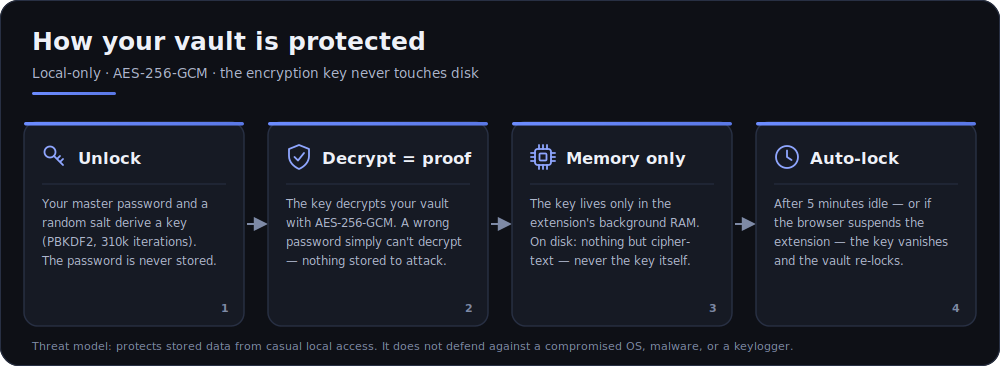

# Pass123

A privacy-first Chrome (Manifest V3) extension for **local, encrypted password storage and generation**. No accounts, no servers — your vault is encrypted with a master password and never leaves your machine.

See [`IDEA.md`](./IDEA.md) for the full concept and roadmap.

## Stack

- **Manifest V3** + **TypeScript**
- **Vite** with the **[CRXJS](https://crxjs.dev) plugin** (HMR for the popup, content & background)
- **Web Crypto API** for all cryptography — PBKDF2 (key derivation) + AES-256-GCM (encryption)

## Develop

```bash
npm install      # install dependencies
npm run dev      # start Vite with HMR; writes a dev build to dist/
```

Then load it in Chrome:

1. Open `chrome://extensions`
2. Enable **Developer mode** (top-right)
3. **Load unpacked** → select the `dist/` folder

The popup and content scripts hot-reload while `npm run dev` runs.

## Build & package

```bash
npm run typecheck   # tsc --noEmit
npm test            # run unit tests (Vitest)
npm run build       # type-check + production build into dist/
npm run icons       # regenerate the action icons (public/icons/*.png)
npm run zip         # build, then zip dist/ → pass123.zip (for the Web Store)
```

## Tests

Unit tests live next to the code (`src/**/*.test.ts`) and cover the pure logic — crypto round-trips, password generation, and the vault lifecycle. They run in Node with global Web Crypto; `chrome.storage.local` is stubbed in-memory (`test/setup.ts`).

```bash
npm test                                 # all tests, once
npm run test:watch                       # watch mode
npx vitest run src/lib/crypto.test.ts    # a single file
```

## How it works

| Layer | File | Responsibility |
|---|---|---|
| Service worker | `src/background.ts` | Holds the derived key + plaintext **only in memory**; routes all messages; auto-locks after 5 min idle |
| Popup UI | `src/popup/` | Setup / unlock / generator / vault CRUD (vanilla TS) |
| Content script | `src/content.ts` | Detects login fields and autofills on request |
| Crypto | `src/lib/crypto.ts` | PBKDF2 → AES-GCM via Web Crypto |
| Vault | `src/lib/vault.ts` | Entry model + encrypt/decrypt bridge to storage |
| Storage | `src/lib/storage.ts` | `chrome.storage.local` — **ciphertext only** |
| Generator | `src/lib/generator.ts` | CSPRNG password generation + entropy/strength |
| Messaging | `src/lib/messages.ts` | Typed request/response protocol |

> **Navigating the code:** the repo includes a [graphify](https://github.com/safishamsi/graphify) knowledge graph of the codebase. If you've built it (`/graphify .` → outputs to the gitignored `graphify-out/`), open `graphify-out/graph.html` for an interactive map of how the modules connect, or read `GRAPH_REPORT.md` for the high-level tour.

### Security notes



- The master password is **never stored**. The encryption key is derived on unlock and held only in the service worker's memory.
- `chrome.storage.local` only ever contains the PBKDF2 salt, iteration count, and AES-GCM ciphertext (IV + auth tag).
- Wrong master password → AES-GCM decryption simply fails (no separate password check to attack).
- An MV3 service worker can be evicted when idle; this drops the in-memory key and re-locks the vault by design. The popup re-prompts when needed.
- **Threat model:** this protects stored data from casual local access. It does **not** defend against a fully compromised OS, malware, or a keylogger.
